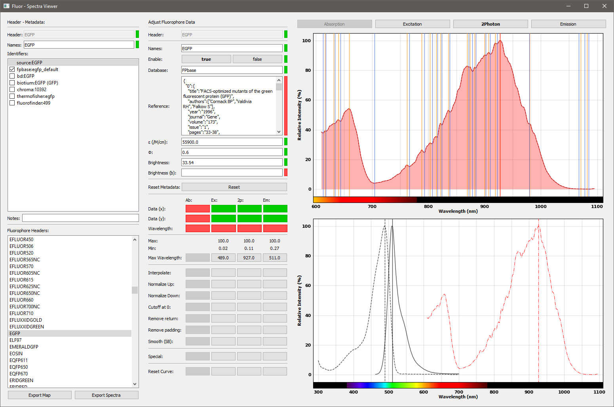

# Fluor Tools

The Fluor Tools is a set of Python classes for the scraping, parsing, comparing, and annotating of fluorophore spectra.  
A GUI interface is provided for detailed manual annotation of the data.  

The toolset is subdivided in three modules:  
● tools - all general class definitions  
● tools.scraper - definitions for the scraping of fluorophore spectra  
● tools.viewer - definitions for the annotation graphical user interface

## Authors

AJ Zwijnenburg

## Requirements

Python >= 3.8.1  

tools.scraper:  
● requests >= 2.22.0  
● lxml >= 4.5.0  
● cryptography >= 2.8  

tools.viewer:  
● PyQt5 >= 5.14.1  
● matplotlib >= 3.1.3  
● scipy >= 1.4.1  

## Installation

Copy the tools folder with all its components to your working directory.  
Make sure the dependencies can be imported.

## Usage

Workflow:  
● Scrape the raw data from multiple sources
● Append the data identifiers to the Source_map
● (Optional) write a Modifyer for the data source
● Use the viewer to select the source and annotate data
● Run the quality control to check for essential data properties
● Use the post-processor to ready the data for Fluor

The first step is to retreive fluorospectra from publicly available sources using specialized scrapers. The scraper looks (in most cases) for the unique identifier used by the source and next requests and retreives the curves.

```python
from tools import Format
from tools.scraper.fpbase import Scraper
import os.path

save_dir = os.path.dirname(os.path.realpath(__file__))

# Instantiate and run scraper
scraper = Scraper()
scraper.scrape_ids()
scraper.scrape_fluorophores()

# Export the data
scraper.export(save_dir, "FPbase", ExportFormat.json)
```

Each source will provide a list of spectra. The mapper tries to collapse the list together so that duplicate spectra get the same unique identifier. This can cause identifiers to not map to spectra anymore (dangle) or vice versa a spectra can lack an unique identifier (be unresolved). The mapper provides a terminal interface to resolve these issues.

```python
from tools.mapper import Map
from tools.reader import Reader
import os.path

FILE_DIR = os.path.dirname(os.path.realpath(__file__))

# Load the Spectra data identification map
map = Map(os.path.join(FILE_DIR, "Source_map.json"))

# Append the scraped data to the map
reader = Reader(os.path.join(FILE_DIR, "Data_FPbase.json"))
map.append(reader)

# Manage dangling and unresolved identifiers
map.manage_dangled()
map.manage_unresolved(reader)

# Export the identification map
map.export(os.path.join(FILE_DIR, "Source_map.json"))
```

Now that we have a collection of spectra, we want to compile the data. The GUI allows one to step through all identifiers and select the curves and metadata of interest. The interface will check standard quality control parameters and provide a visual indicator (red or green). The curves can be interpolated and scaled to Fluor's standard.

```python
from tools.viewer.viewer import MainWindow, Application
from tools.viewer.reader import MappedReader
from tools import modifyer
import sys, os

FILE_DIR = os.path.dirname(os.path.realpath(__file__))

# Prepare the header data
reader = MappedReader(os.path.join(FILE_DIR, "Source_map.json"))

# Add the spectra data
reader.load_data(os.path.join(FILE_DIR, "Data_FPbase.json"))

# (Optional) Load previous annotated source data
reader.load_source_data(os.path.join(FILE_DIR, "Source_data.json"))

# Start the viewer graphical user interface
app = Application([])
main = MainWindow()
main.show()

# Load the header and spectra data into the viewer
main.loadData(reader)

sys.exit(app.exec_())
```



A last quality control of all spectra.

```python
from tools.qc import QC
import os

FILE_DIR = os.path.dirname(os.path.realpath(__file__))

# Load the data into the quality control class for qc checking
qc = QC(os.path.join(FILE_DIR, "Source_data.json"))

# Print the qc results
print(qc)
```

The database generated by Fluor Tools contains all information of all fluorophores. The postprocessor cuts-down the information to the minimally necessary.

```python
from tools.postprocessor import PostProcessor
from tools import Format
import os

FILE_DIR = os.path.dirname(os.path.realpath(__file__))

# Load the data into the postprocessor class
post_processor = PostProcessor(os.path.join(FILE_DIR, "Source_data.json"))

# Run the post processor
post_processor.process()

# Export the data
post_processor.export(FILE_DIR, "fluorophores")
```

## Known Issues

There is a memory-leak. I suspect in the matplotlib. The leak becomes evident when viewing a lot of plots sequentially.  
Small changes in the target webpages confuse scrapers. These scrapers are a few years old and likely do not work anymore.

## Contributing

Bug reports, idea's, and push request are very welcome!

## Version List

v2.1 - Updated README
v2.0 - Updated scrapers to only use the requests library
v1.0 - Selenium library based scrapers  

## License

tools: [MIT](https://choosealicense.com/licenses/mit/)  
tools.scraper: [MIT](https://choosealicense.com/licenses/mit/)  
tools.viewer: [GPLv3](https://choosealicense.com/licenses/gpl-3.0/)  
